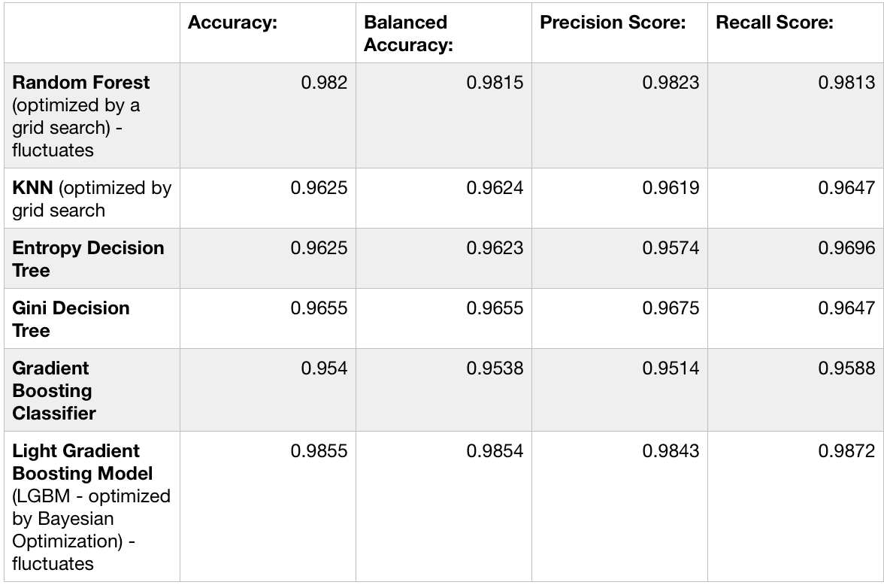

# Capstone2_Final_Report:
# Phishing Website Detection Model:
    Phishing schemes seek to take advantage of the human element in what might be an otherwise secure system. Better detection of phishing websites (for instance, those contained within phishing e-mails) can be the difference between a person's credentials being hijacked by a nefarious actor to compromise a system and that link being flagged as unsafe before the fact.
    The intention of this project is to create a ML model that can reliably detect a phishing website at a high level of success with minimal false positives.
    
## 1. Data
    The detection model was created using a kaggle dataset, at link to which is below. The datset itself contains information about 5,000 phishing websites and 5,000 non-phishing websites, defined according to 48 parameters. The 48 parameters are: Number of Dots, Subdomain Level, Path Level, Url Length, Number of Dashes, Number of Dashes In Hostname, At Symbol, Tilde Symbol, Number of Underscores, Number of Percents, Number of Query Components, Number of Ampersands, Number of Hashes, Number of Numeric Characters, No Https, Random String, IpAddress, Domain In Subdomains, Domain In Paths, Https In Hostname, Hostname Length, Path Length, Query Length, Double Slash In Path, Number of Sensitive Words, Embedded Brand Name, Percent of Extensions in Hyperlinks, Percent of Extensions in Resource Urls, Favicon, Insecure Forms, Relative Form Action, Extension Form Action, Abnormal Form Action, Percent of Null Self Redirects in Hyperlinks, Frequent Domain Name Mismatch, Fake Link In Status Bar, Right Click Is Disabled, Pop Up Window, Submit Info To Email, Iframe Or Frame, MissingTitle, Images Only In Form, Subdomain Level RT, Url Length RT, Percent of Extension Resource Urls RT, Abnormal Extension Form Action RT, Extension Meta Script Link RT and Percent of Extension Null Self Redirect Hyperlinks RT.
    Finally, the 'Class' category within the dataset contains a boolean value: 1 for nefarious and 0 for not nefarious. By utilizing this category alongside the other contained information, a prediction model can be crafted.
###### [Kaggle Dataset](https://www.kaggle.com/shashwatwork/phishing-dataset-for-machine-learning)

## 2. Data Cleaning
    Within the data cleaning process, many of the features were discovered to be boolean values representing either yes or no; for instance: 'yes' or 'no' to the question of whether or not there was a missing title in the website. 
    This was a very clean dataset overall, with minimal pre-preprocessing necessary. All variables were already numeric, removing the necessity of one-hot encoding text-based categorical features. Five features ('SubdomainLevelRT', 'UrlLengthRT', 'PctExtResourceUrlsRT', 'AbnormalExtFormActionR', 'ExtMetaScriptLinkRT', 'PctExtNullSelfRedirectHyperlinksRT') were discovered to be categorically grouped into ['-1', '0', '1']. With imperfect knowledge of what these categories precisely specify, they were ultimately one-hot encoded ahead of the modeling stage. When this resulted in worse scores than not altering the dataset, this step was removed.There were also no missing values to be handled.
   
###### [Pre-Processing](https://github.com/eerogers/Cap2PreProcessing/blob/master/Cap2PreProcessing.ipynb)

## 3. EDA
    The primary process within EDA was a visualization of the various features in order to ascertain their general makeup and relationship to each other. Histograms and violinplots were constructed for each variable, broken up by class to show how different features vary according to their nefarious or non-nefarious nature. Heatmaps were also made to visualize and strong relationship between variables.
    It was discovered during EDA that one feature ('HttpsInHostname') could be dropped due to its value being '0' in all cases. The 'id' column was also dropped ahead of the modeling stage.
    Though most of the features are booleans or ints specifyng a precise number (for examples, the number of characters in a url string), still three features were noted as floats specifying a percentage. These are 'PctNullSelfRedirectHyperlinks', 'PctExtHyperlinks', 'PctExtResourceUrls'. They were specifically examined at this stage and their importance becomes clear in the modeling stage.
###### [EDA](https://github.com/eerogers/Phishing_EDA/blob/master/EDA.ipynb)

## 4. Modeling
    Random Forest, KNN, gini and entropy Decision Tree models, a Gradient Boosting Classifier, and Light Gradient Boosting Machine (using a Bayesian Optimization) were all applied to the data. The most effective models, according to the accuracy, balanced accuracy, precision score and recall score metrics, were Random Forest and Light Gradient Boosting. The Random Forest model returned an overall accuracy score of .982, (with the grid search's results fluctuating in its recommendation of optimal estimators), while the Light Gradient Boosting model returned an overall accuracy of .985, with the parameters recommended by the Bayesian Optimization likewise fluctating somewhat.
###### [Modeling](https://github.com/eerogers/cap2_modeling/blob/master/Modeling.ipynb)

## 5. Predictions
    The predictive ability of the compiled models can be seen more precisely in the graph below. It should be noted that the Light Gradient Boosting model and the Random Forest model (the two highest scores) both saw their scores fluctuate somewhat (a degree of randomness occurs in th both). Still, the general range of their accuracy scores remains consistent and the LGBM earns a higher score in all of the measured categories.

## 6. Choosing Between Two High-Performing Models:
    Though the LGBM is potentially more computationally intensive than the Random Forest model, still its higher scores across the board are a very strong argument that it is the best choice. LGBM's higher recall score specifically makes it less likely to wrongly categorize a website as non-nefarious.
    